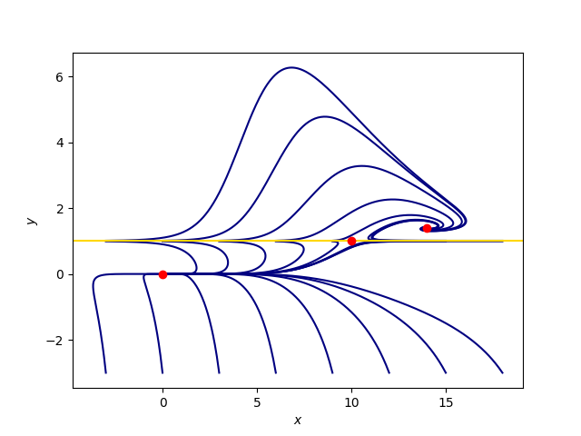

# edge_tracking_julia

Solve a 2D toy problem to visualise coexisting "laminar" and "turbulent" states, and identify the edge and edge state separating the asymptotic behaviour of the solution.

<!--
2D phase plane of the toy problem
$$\begin{aligned}
\dot{x} &= -x + 10y,\\
\dot{y} &= y (10 \mathrm{e}^{-0.01 x^2} - y) (y-1).
\end{aligned}$$
Navy lines denote solution from different initial conditions.
Horizontal yellow line is the edge state $y = 1$.
Three red dots denote the "laminar" state at $(x,y) = (1,0)$, "turbulent" state at $(14, 1.4)$, and the edge state $(10, 1)$.
 -->

Cf.[Rich Kerswell, "Edge Tracking - Walking the Tightrope"](https://gfd.whoi.edu/wp-content/uploads/sites/18/2018/03/rich8_131207.pdf)
